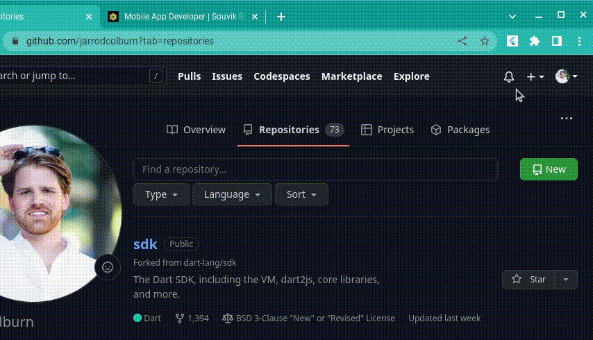

# Flutter QR - Current tab URL - Chrome extension

## This repo builds on the excellent demo from Souvik Biswas. Please see his [original repo](https://github.com/sbis04/flutter_qr_extension) first. 

## This version demos Flutter calling `chrome` extension api using `js` package. 

## Specificly this version calls `chrome.tabs.query` to generate the QR Code using the URL of the current Chrome tab (instead of user text input).

## As little as possible was changed from origianl demo. Changes include:
* `web/manifest.json` add: `activeTab` permission
* `pubspec.yaml` add: dependency `js`
* `lib/chrome_interop.dart` create: interop with javascript `chrome.tabs.query` and param/return objects 
* `chrome_interop_helper.dart` create: convenience wrapper function `getCurrentTabUrl` to query current tab, casting js dynamic return types to a Future<String>.
* `lib/qr_view.dart` edit: Calls `getCurrentTabUrl` to retrieve current tab url. Updating text field and QR with result (makes field uneditable by user).



## Usage

To use this project as a Chrome extension, follow the steps below:

1. Clone this project using:
   
    ```sh
    git clone https://github.com/jarrodcolburn/flutter_qr_extension.git
    ```

2. From the project directory, run:
   
   ```sh
   flutter build web --web-renderer html --csp
   ```

3. Go to the following URL from Chrome browser:
   
   ```url
   chrome://extensions
   ```

4. Enable the **Developer mode**.

5. Click **Load unpacked**. Select the `<project_dir>/build/web` folder.

This will install the extension to your Chrome browser and then you will be able to access the extension by clicking on the **extension icon**.

## License

Copyright (c) 2022 Souvik Biswas

Permission is hereby granted, free of charge, to any person obtaining a copy
of this software and associated documentation files (the "Software"), to deal
in the Software without restriction, including without limitation the rights
to use, copy, modify, merge, publish, distribute, sublicense, and/or sell
copies of the Software, and to permit persons to whom the Software is
furnished to do so, subject to the following conditions:

The above copyright notice and this permission notice shall be included in all
copies or substantial portions of the Software.

THE SOFTWARE IS PROVIDED "AS IS", WITHOUT WARRANTY OF ANY KIND, EXPRESS OR
IMPLIED, INCLUDING BUT NOT LIMITED TO THE WARRANTIES OF MERCHANTABILITY,
FITNESS FOR A PARTICULAR PURPOSE AND NONINFRINGEMENT. IN NO EVENT SHALL THE
AUTHORS OR COPYRIGHT HOLDERS BE LIABLE FOR ANY CLAIM, DAMAGES OR OTHER
LIABILITY, WHETHER IN AN ACTION OF CONTRACT, TORT OR OTHERWISE, ARISING FROM,
OUT OF OR IN CONNECTION WITH THE SOFTWARE OR THE USE OR OTHER DEALINGS IN THE
SOFTWARE.
